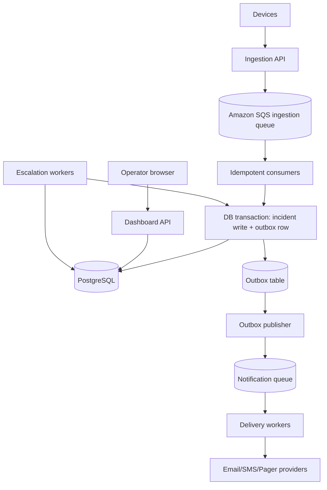

# Scaling Design

## Implemented Assignment

The submitted implementation is a compact incident system: HTTP ingestion writes directly to PostgreSQL, operators and admins use a JWT-protected API, incident/history changes are transactional, and a separate polling worker escalates overdue high-severity incidents. It does not implement durable queues, real notification providers, read replicas, partitioning, or measured high-volume capacity.

This design section describes a proposed production direction for larger deployments while keeping the implemented assignment distinct.

## Capacity Assumptions

“50,000 devices” does not by itself define throughput. Event frequency, burst shape, payload size, retry behavior, and severity mix must be measured. For example, if 50,000 devices each send one event every 5 minutes, the average rate is about 167 events per second. A reboot storm or network recovery could produce much higher bursts, and payload size affects queue, database, and network capacity.

No measured capacity is claimed for the assignment implementation.

## Proposed Production Flow

Amazon SQS is a reasonable queue choice for this proposed design because it is managed, durable, horizontally scalable, and supports dead-letter queues. The tradeoff is less ordering control than Kafka and provider-specific operational coupling. If strict ordered streams or replay analytics became central requirements, Kafka-compatible infrastructure could be reconsidered.

The ingestion API should return `202 Accepted` only after the event has been durably accepted by the queue. It should preserve the initial server acceptance time through all processing stages so escalation deadlines are not reset by queue lag. Production device protocol should require stable device event IDs, and consumers should process retries idempotently using `(source, eventId)` or an equivalent stable key.

If PostgreSQL is down but the queue is accepting messages, accepted events remain queued for retry subject to queue retention. If durable enqueue fails, the API should return a retryable error and devices should retry with the same event ID. High-severity events should have reserved processing capacity through a separate priority queue or reserved consumer pool so noisy low-severity traffic cannot starve urgent incidents.

## Storage and Dashboard Responsiveness

PostgreSQL remains a good fit for canonical incident state because it supports relational integrity, indexed filters, row-level locking, and transactions across incident/history/outbox writes. Dashboard queries should be bounded and indexed, with cursor pagination for deep navigation. Partitioning by time and retention jobs should be introduced only after event volume justifies the operational complexity.

Read replicas can help dashboard read traffic, but operator actions must avoid confusing stale reads. After acknowledgement, resolution, or assignment, the API can return the committed row directly and force the client to refresh from the primary or use a short read-your-write window before returning to replica reads.

Dashboards can remain responsive with five-second polling, as implemented here for the assignment, or with server-sent events for lower-latency updates. Either approach should monitor query latency and payload size and avoid unbounded totals or scans.

## Reliable Notifications

Incident changes and outbox rows should commit in the same PostgreSQL transaction. An outbox publisher reads committed outbox rows and sends notification jobs to a notification queue. Delivery workers consume that queue and call email, SMS, or pager providers.

Notification jobs should carry stable notification identifiers, and provider idempotency keys should be used where supported. Duplicate sends can still happen after a worker crash or ambiguous provider response, so provider callbacks and delivery records must tolerate duplicates. Delivery workers need rate-limit handling, exponential backoff with jitter, fallback providers or channels, dead-letter queues, and replay tooling.

Provider acceptance or delivery is separate from human acknowledgement. A provider can accept a page while the incident remains open. Escalation policy should define primary and secondary responders, fan-out timing, and when acknowledgement stops future paging. The system should not promise guaranteed human contact during a total communications outage.

Degraded modes should preserve the acceptance time and retry path. If PostgreSQL is degraded after queue acceptance, consumers keep retrying queued events until retention is exhausted, and the original acceptance timestamp is used when the incident is finally written. If the ingestion queue is degraded, the API returns a retryable error and devices retry with the same event ID rather than pretending the event was accepted. If a notification provider is degraded, delivery workers back off with jitter, try fallback providers or channels when policy allows, and move exhausted jobs to a dead-letter queue for replay. Critical alerts do not become guaranteed human contact during provider or communications outages; they remain durable work items that page responders once dependencies recover.

## Monitoring and Failure Modes

Production monitoring should track ingestion queue age, consumer lag, escalation lateness, worker heartbeat freshness, notification failure rate, dead-letter depth, database health, lock waits, and API latency. External synthetic checks should exercise ingestion and operator paths. The alerting system itself needs an independent alert channel so failures in notification delivery can still be noticed.

Partial failures are expected: queues can grow, replicas can lag, providers can rate-limit, and workers can restart. Retention limits mean very old queued events may eventually expire. The system should make these limits explicit and surface them operationally.

## Tradeoffs

The assignment implementation favors simplicity and low cost: direct database writes, polling escalation, and no provider integrations. The proposed production design improves reliability and burst tolerance but adds queue operations, eventual consistency, duplicate handling, outbox maintenance, provider contracts, and more monitoring. Those costs are justified only when measured throughput, reliability requirements, and operational maturity require them.
